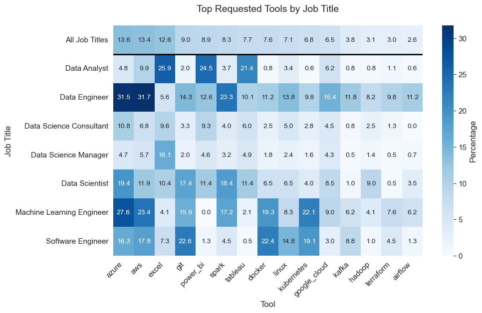
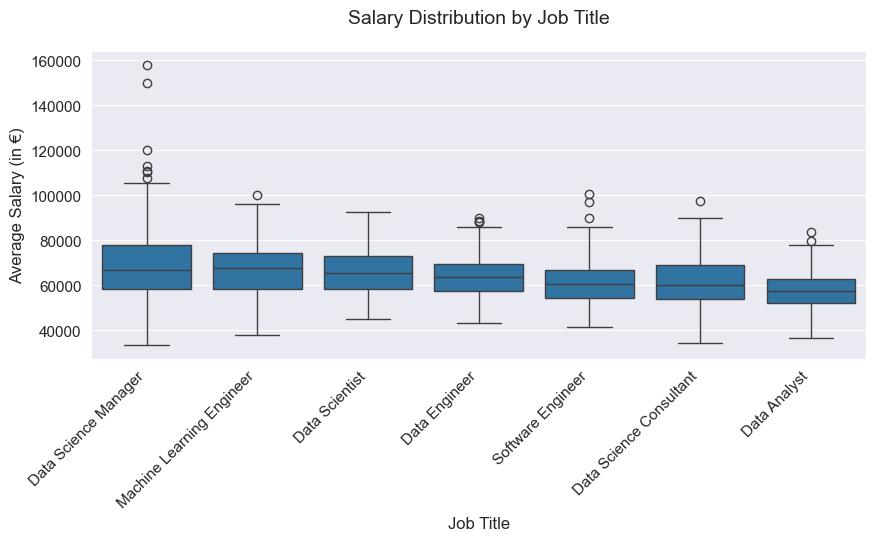
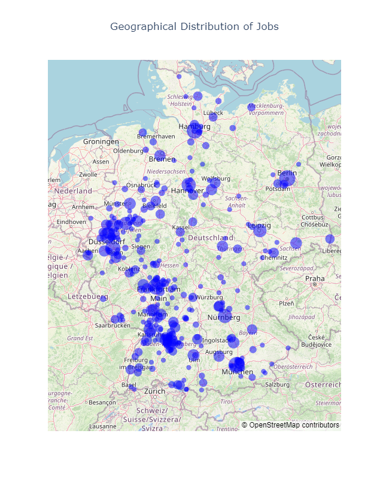
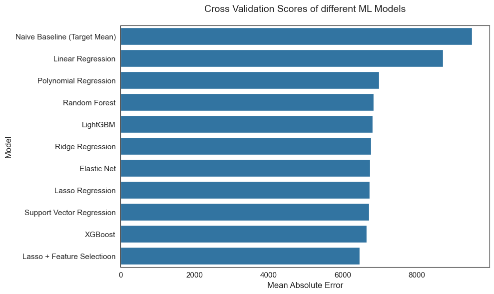
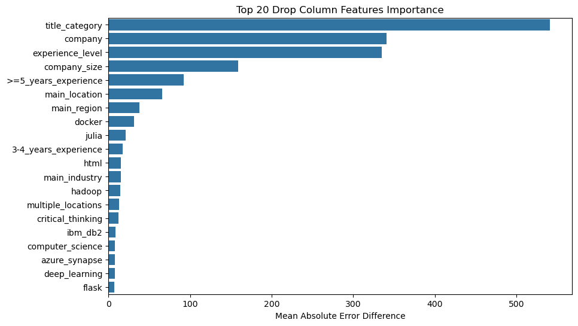
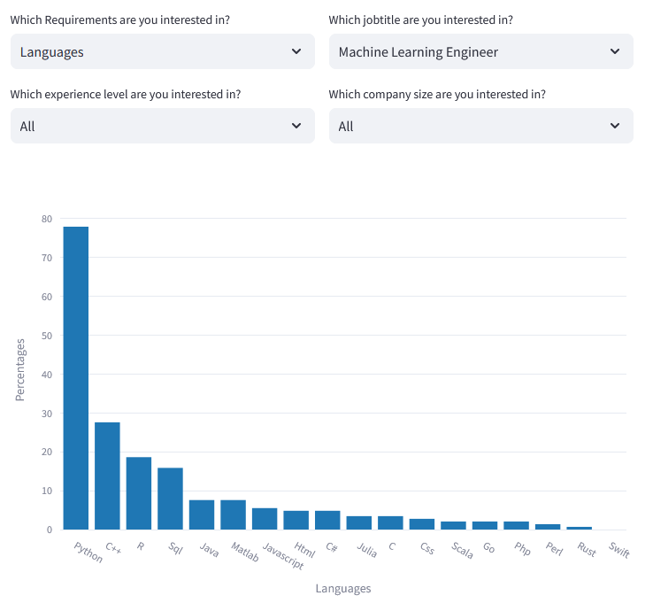
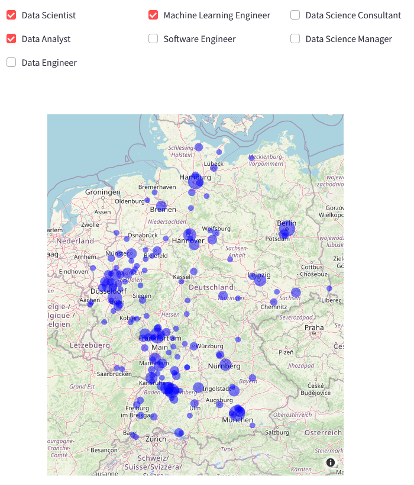
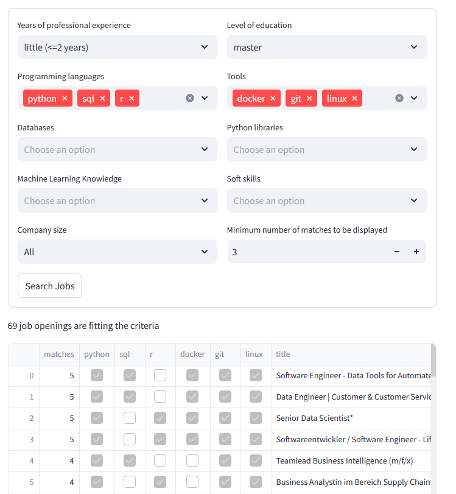
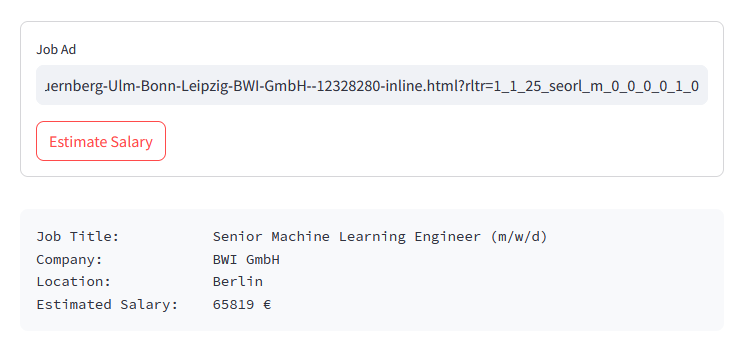

# 📊 Data Science Job Market Analysis – Germany 

In this project, over **3000 job offers** in the field of data science in Germany were automatically collected from a job exchange and then analyzed in order to gain more precise insights into the current job market. The results of the analysis are also available to other users within an **interactive web app**, which offers the following options:

- 🧠 **Skill Gap Analysis:** What skills and tools are most expected for my desired career?

- 🎯 **Job Recommendation System:** Which advertised jobs are best suited to my current skillset?

- 🗺️ **Regional Analysis:** Where in Germany are the most suitable jobs available?

- 💰 **Salary Estimate:** What is the approximate salary I can expect to earn in my desired job?


👉 [🔗 Link to Web App](https://data-science-job-analysis-germany.streamlit.app/)


## Table of Contents

- [Data Collection](#data-collection)
- [Preprocessing](#preprocessing)
- [Data Analysis](#data-analysis)
- [Model Building](#model-building)
- [Deployment](#deployment)
- [Installation and Usage](#usage)


## Data Collection

A webscraper was implemented using Beautifulsoup and Selenium that searches job listings on the website "https://www.stepstone.de" and saves various 
attributes of each of the jobs offered in a .csv file. The extracted information includes:
- Job title
- Company
- Text description
- Location
- Industry
- Job rating
- Salary projection
- Company size
- Contract type
- Work type

Furthermore, the API of "https://positionstack.com/" was used to retrieve additional geographical information (e.g, federal state 
and geo-coordinates) for each location.


## Preprocessing

Subsequently, the raw data was cleaned, as well as new features were created from the existing information using Pandas. The following steps were carried out:
- Filtering out the relevant work types and contract types.
- Classification of job titles into seven categories (Data Scientist, Data Analyst, Data Engineer, 
Machine Learning Engineer, Software Engineer, Data Science Consultant, Data Science Manager)
- Capture experience level from job titles (Junior, Senior)
- Conversion of salary ranges into average salaries
- Standardization of location information using regular expressions
- Join the additional geographical informations with the rest of the data
- Standardization and binning of company size information
- Capture of various requirements from the text description of the job ads using regular expressions 
    - Programming languages
    - Tools
    - Databases
    - Python libraries
    - Education
    - Degree
    - Knowledge
    - Soft skills
    - Professional experience
- Remove duplicate entries
    

## Data Analysis

An exploratory data analysis was then performed. The graphs were created with the help of Seaborn and Plotly. The aspects to which particular attention was paid here include:
- Analysis of the requirements for candidates
    - What skills (e.g., programming languages, tools or soft skills) are most often required? Are there differences between job titles?
    - What degrees and how much work experience are required?
- How does the size of the company affect the jobs and requirements needed?
- In which regions of Germany are there the most vacancies?
- Which attributes of the job influence the salary?

<table>
<tr>
  <td width="50%" valign="top">
    
    
  </td>
  <td width="50%">
    
  </td>
</tr>
</table>


## Model Building

Next, I tried to predict the salary of a job ad by the remaining variables. First, 20% of the data was split off as test data. The remaining data was used for cross validation. The Mean Absolute Error (MAE) was chosen as the optimization criterion, since large errors should not be penalized more than small ones. For categorical features One-Hot-Encoding and Target Encoding were tested. Missing values were replaced by a new category "missing_value". When using Target Encoding, the features where scaled afterwards. Then the following models were tested and tuned using Randomized Search:

<table>
<tr>
  <td width="50%">
    
  </td>
  <td width="50%">
    
  </td>
</tr>
</table>

With the best model, an MAE of 6455 € was achieved, which represents an improvement of over 3000 € compared to the target mean, which was used as a naive baseline.
The drop column feature importanes were then calculated for the graph on the right in order to find out which features contributed most to reducing the error. During the model selection process different machine learning libraries like Scikit-Learn, XGBoost and LightGBM were used.


## Deployment

Finally, an interactive web  was implemented using Streamlit, which allows users to perform certain analyses on the 
data themselves. The web app was hosted via the Streamlit Cloud and can be accessed at 
https://data-science-job-analysis-germany.streamlit.app/. It contains four standalone 
modules:

<table border="0" cellspacing="0">
<tr>
  <td width="50%" align="center">
    <h3>Requirements Analysis</h3>
  </td>
  <td width="50%" align="center">
    <h3>Geographical Analysis</h3>
  </td>
</tr>
<tr>
  <td width="50%" align="center">
    
  </td>
  <td width="50%" align="center">
    
  </td>
</tr>
<tr>
  <td width="50%">
    <p>This interface offers the possibility to display the most important requirements for different job titles, experience levels and company sizes.</p>
  </td>
  <td width="50%">
    <p>This interface provides an overview of the geographical distribution of available data science jobs in Germany. The data can be filtered by job title.</p>
  </td>
</tr>
</table>
<table border="0" cellspacing="0">
<tr>
  <td width="50%" align="center">
    <h3>Job Recommendation</h3>
  </td>
  <td width="50%" align="center">
    <h3>Salary Estimation</h3>
  </td>
</tr>
<tr>
  <td width="50%" align="center">
    
  </td>
  <td width="50%" align="center">
    
  </td>
</tr>
<tr>
  <td width="50%">
    <p>This interface provides a recommendation system for job openings based on the user's skills and preferences.</p>
  </td>
  <td width="50%">
    <p>This interface offers the possibility to estimate the salary for a given job ad on Stepstone.</p>
  </td>
</tr>
</table>


## Usage

1. Clone repository: 
    ````
    git clone https://github.com/Joachim93/Data-Science-Job-Analysis.git
    ````
   
2. Install dependecies:
    ````
    pip install -r requirements.txt
    ````
   
3. Update the ``src/config.py``:

    To collect the data, some personal data is needed, which is stored in the file ``config.py`` and should not be public. The public version of this file only contains a user agent for the webscraper. The other information need to be added by each user on their own. The following variables can be defined there:
    
    - ``header = {"User-Agent": "..."}``
        - the user agent helps to disguise that the requests are automatic queries
        - your own user agent can be easily googled via "my user agent" and inserted into the template above

    - ``stepstone_email`` und ``stepstone_password``
        - is only needed if the salary forecasts of all jobs, which are only visible when logged in, are to be 
        retrieved as well
        
    - ``positionstack_key``:
        - is only required if additional geographic information about the locations is to be retrieved as well
        - the required key can be read directly on the start page after creating an account and logging in
        
4. Using the webscraper (example):
    ````
    python src/webscraper.py --directory data --keywords data_science machine_learning --salary
    ````
    - in this case the webscraper searches all job offers under the search terms "data science" and "machine learning 
    and stores the information in the folder "data
    - the ``--salary`` flag indicates that salary information should also be scraped
    
5. Preprocessing of the data (example):
    ````
    python src/preprocessing.py --directory data --geo_data
    ````
    - the script transforms the raw data in the specified folder into a format suitable for the analysis and stores 
    them in the same folder
    - the ``--geo_data`` flag indicates that geographic information should also be retrieved from the Positionstack-API
    should be retrieved
    
6. Running the web app:
    ````
    streamlit run src/webapp.py
    ````
    - if during data collection another name than "data" was chosen for the folder with data, it must be changed 
    manually in the code of the function "load_data" in the file ``src/webapp.py`` manually.

**Note 1:** The code of the webscraper interacts with an external website, which can change at any time. Therefore, it is possible that a few minor adjustments to the latest changes to the website may need to be made before using the webscraper or the salary estimation in order for it to function properly.

**Note 2:** The Positionstack API has now changed its terms of use so that only 100 free requests can be made per month.

**Note 3:** The salary estimate can only be used if the web app is accessed locally, as any requests from the Streamlit Cloud are blocked by the website. 